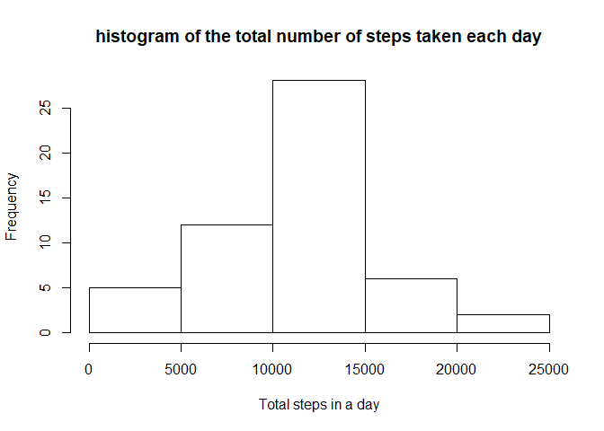
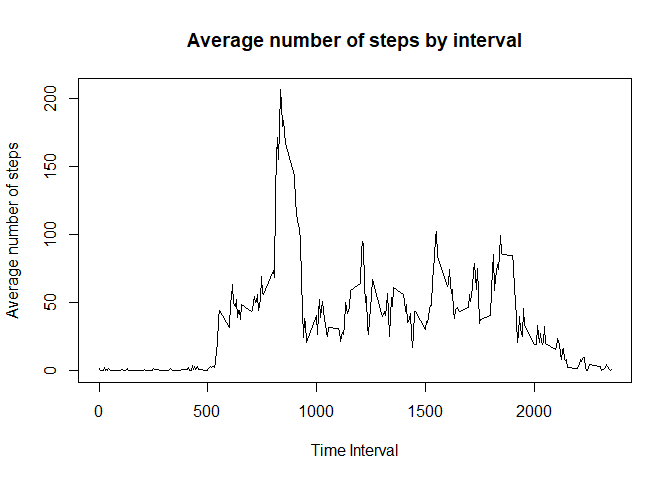
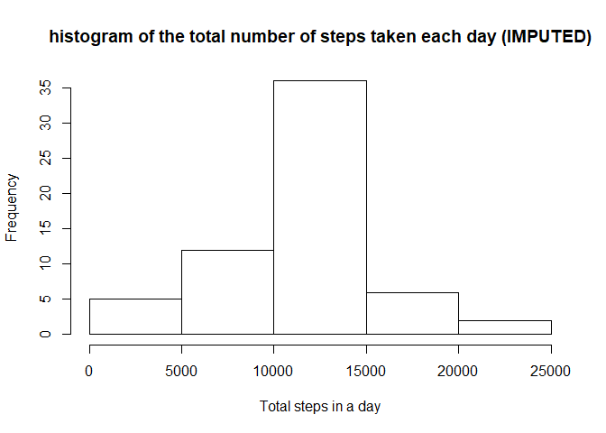
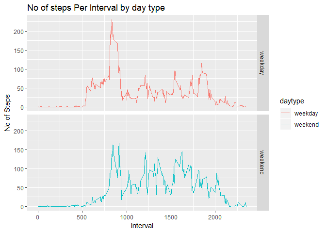

## Loading and preprocessing the data

```r
#set the working directory
#setwd("~/Coursera/Reproducible Research/Week 2/Project")
#load required libraries 
library(ggplot2)
library(dplyr)
```

```
## 
## Attaching package: 'dplyr'
```

```
## The following objects are masked from 'package:stats':
## 
##     filter, lag
```

```
## The following objects are masked from 'package:base':
## 
##     intersect, setdiff, setequal, union
```

```r
#load data by reading in the .csv file

activitydata <- read.csv("activity.csv")

#check the data 
str(activitydata)
```

```
## 'data.frame':	17568 obs. of  3 variables:
##  $ steps   : int  NA NA NA NA NA NA NA NA NA NA ...
##  $ date    : Factor w/ 61 levels "2012-10-01","2012-10-02",..: 1 1 1 1 1 1 1 1 1 1 ...
##  $ interval: int  0 5 10 15 20 25 30 35 40 45 ...
```

```r
names(activitydata)
```

```
## [1] "steps"    "date"     "interval"
```

```r
head(activitydata)
```

```
##   steps       date interval
## 1    NA 2012-10-01        0
## 2    NA 2012-10-01        5
## 3    NA 2012-10-01       10
## 4    NA 2012-10-01       15
## 5    NA 2012-10-01       20
## 6    NA 2012-10-01       25
```

```r
#remove NAs 
activitydatacomp <- activitydata[complete.cases(activitydata), ]
str(activitydatacomp)
```

```
## 'data.frame':	15264 obs. of  3 variables:
##  $ steps   : int  0 0 0 0 0 0 0 0 0 0 ...
##  $ date    : Factor w/ 61 levels "2012-10-01","2012-10-02",..: 2 2 2 2 2 2 2 2 2 2 ...
##  $ interval: int  0 5 10 15 20 25 30 35 40 45 ...
```

```r
names(activitydatacomp)
```

```
## [1] "steps"    "date"     "interval"
```

```r
head(activitydatacomp)
```

```
##     steps       date interval
## 289     0 2012-10-02        0
## 290     0 2012-10-02        5
## 291     0 2012-10-02       10
## 292     0 2012-10-02       15
## 293     0 2012-10-02       20
## 294     0 2012-10-02       25
```


## What is mean total number of steps taken per day?

1. Calculate the total number of steps taken per day

```r
per_day <- group_by(activitydatacomp, date)
total_steps_day  <- summarise(per_day, totalsteps = sum(steps))
total_steps_day  <- as.data.frame(total_steps_day)
head(total_steps_day) 
```

```
##         date totalsteps
## 1 2012-10-02        126
## 2 2012-10-03      11352
## 3 2012-10-04      12116
## 4 2012-10-05      13294
## 5 2012-10-06      15420
## 6 2012-10-07      11015
```
2. If you do not understand the difference between a histogram and a barplot, research the difference between them. Make a histogram of the total number of steps taken each day

```r
h <- hist(total_steps_day$totalsteps, main="histogram of the total number of steps taken each day", 
     xlab="Total steps in a day")
```

<!-- -->

```r
h
```

```
## $breaks
## [1]     0  5000 10000 15000 20000 25000
## 
## $counts
## [1]  5 12 28  6  2
## 
## $density
## [1] 1.886792e-05 4.528302e-05 1.056604e-04 2.264151e-05 7.547170e-06
## 
## $mids
## [1]  2500  7500 12500 17500 22500
## 
## $xname
## [1] "total_steps_day$totalsteps"
## 
## $equidist
## [1] TRUE
## 
## attr(,"class")
## [1] "histogram"
```
3. Calculate and report the mean and median of the total number of steps taken per day

```r
#mean total number of steps taken per day
stepsmean <- round(mean(total_steps_day$totalsteps))


#mean total number of steps taken per day
stepsmedian <- median(total_steps_day$totalsteps)
```
### report
The Mean of the total steps taken per day is  1.0766\times 10^{4} while the Median is 10765 .

## What is the average daily activity pattern?
1. Make a time series plot (i.e. type="l") of the 5-minute interval (x-axis) and the average number of steps taken, averaged across all days (y-axis)

```r
#get averages
interval_step_ave <- aggregate(steps ~ interval, activitydata, mean)

#plot time series
plot(interval_step_ave$interval, interval_step_ave$steps, type='l', col=1, main="Average number of steps by interval", xlab="Time Interval", ylab="Average number of steps")
```

<!-- -->


2. Which 5-minute interval, on average across all the days in the dataset, contains the maximum number of steps?

```r
interval_maxsteps <- which.max(interval_step_ave$steps)

interval_step_ave[interval_maxsteps, ]
```

```
##     interval    steps
## 104      835 206.1698
```

## Imputing missing values
Note that there are a number of days/intervals where there are missing values (coded as NA). The presence of missing days may introduce bias into some calculations or summaries of the data.

1. Calculate and report the total number of missing values in the dataset (i.e. the total number of rows with NAs)

```r
#calculate number on NAs
NA_number <- sum(is.na(activitydata))
```
### report 
The number of NAs is  2304  .

2. Devise a strategy for filling in all of the missing values in the dataset. The strategy does not need to be sophisticated. For example, you could use the mean/median for that day, or the mean for that 5-minute interval, etc.
3. Create a new dataset that is equal to the original dataset but with the missing data filled in.

```r
#create new data from original
imputedactivitydata <-  activitydata
```

```r
#to find and fill, the NAs , use for loop and replace NAs in the original data with average values for respective intervals in the average data 

for (i in 1:nrow(imputedactivitydata)) {
    if(is.na(imputedactivitydata$steps[i])) {
        fillvalue <- interval_step_ave$steps[which(interval_step_ave$interval == imputedactivitydata$interval[i])]
        imputedactivitydata$steps[i] <- fillvalue
    }
}

head(imputedactivitydata)
```

```
##       steps       date interval
## 1 1.7169811 2012-10-01        0
## 2 0.3396226 2012-10-01        5
## 3 0.1320755 2012-10-01       10
## 4 0.1509434 2012-10-01       15
## 5 0.0754717 2012-10-01       20
## 6 2.0943396 2012-10-01       25
```

4. Make a histogram of the total number of steps taken each day and Calculate and report the mean and median total number of steps taken per day. Do these values differ from the estimates from the first part of the assignment? 

```r
imputeper_day <- group_by(imputedactivitydata, date)
imputetotal_steps_day  <- summarise(imputeper_day, imputetotalsteps = sum(steps))
imputetotal_steps_day <- as.data.frame(imputetotal_steps_day)
head(imputetotal_steps_day)
```

```
##         date imputetotalsteps
## 1 2012-10-01         10766.19
## 2 2012-10-02           126.00
## 3 2012-10-03         11352.00
## 4 2012-10-04         12116.00
## 5 2012-10-05         13294.00
## 6 2012-10-06         15420.00
```

```r
 hist(imputetotal_steps_day$imputetotalsteps, main="histogram of the total number of steps taken each day (IMPUTED)", 
     xlab="Total steps in a day")
```

<!-- -->


5. What is the impact of imputing missing data on the estimates of the total daily number of steps?

```r
#mean total number of steps taken per day original data
stepsmean <- round(mean(total_steps_day$totalsteps))
stepsmean
```

```
## [1] 10766
```

```r
#mean total number of steps taken per day original data
stepsmedian <- median(total_steps_day$totalsteps)
stepsmedian
```

```
## [1] 10765
```

```r
#mean total number of steps taken per day imputed data
imputestepsmean <- round(mean(imputetotal_steps_day$imputetotalsteps))
imputestepsmean
```

```
## [1] 10766
```

```r
#mean total number of steps taken per day imputed data
imputestepsmedian <- median(imputetotal_steps_day$imputetotalsteps)
imputestepsmedian
```

```
## [1] 10766.19
```
### report 
Imputing the data resulted in no change in the mean but the median increased by 1.1886792


## Are there differences in activity patterns between weekdays and weekends?
1. Create a new factor variable in the dataset with two levels - "weekday" and "weekend" indicating whether a given date is a weekday or weekend day.

```r
#create new column using weekdays () function
imputedactivitydata['daytype'] <- weekdays(as.Date(imputedactivitydata$date))
#convert to either weekend or weekday
imputedactivitydata$daytype[imputedactivitydata$daytype  %in% c('Saturday','Sunday') ] <- "weekend"
imputedactivitydata$daytype[imputedactivitydata$daytype != "weekend"] <- "weekday"
# convert daytype variable from character to factor
imputedactivitydata$daytype <- as.factor(imputedactivitydata$daytype)


levels(imputedactivitydata$daytype)
```

```
## [1] "weekday" "weekend"
```
2. Make a panel plot containing a time series plot (i.e. type="l") of the 5-minute interval (x-axis) and the average number of steps taken, averaged across all weekday days or weekend days (y-axis). See the README file in the GitHub repository to see an example of what this plot should look like using simulated data.

```r
# Create the aggregated data frame by intervals and day_type
average_daytype_steps <- aggregate(steps ~ interval+daytype, imputedactivitydata, mean)

#plot to compare 

ggplot(average_daytype_steps, aes(interval, steps)) +
    geom_line(stat = "identity", aes(colour = daytype)) +
    theme_gray() +
    facet_grid(daytype ~ ., scales="fixed", space="fixed") +
    labs(x="Interval", y=expression("No of Steps")) +
    ggtitle("No of steps Per Interval by day type")
```

<!-- -->


### Report
Comparatively, the users took more steps in earlier intervals on weekdays while they took more steps in later intervals on weekends.
